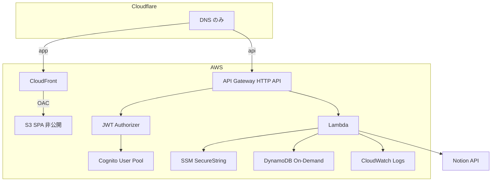

# AWS 構成方針

筋トレメモを、Notion ラッパー個人 Web アプリの **AWS 学習サンプル**として置くための方針です。第一用途は筋トレの記録です。画面の動きと Notion の列は [README](../README.md) が正です。このページは「なぜ AWS か」と「何を作るか」だけを固定します。

IaC の骨格は [#8](https://github.com/tag0203/kintore-memo/issues/8) で `infra/template.yaml`（AWS SAM）にあります。デプロイと `sam local` の手順は [aws-deploy.md](./aws-deploy.md)、Cognito ログインは [aws-auth.md](./aws-auth.md)、単一テーブルは [dynamodb.md](./dynamodb.md) です。本番の Notion ラッパーは Go の `api/`（[#23](https://github.com/tag0203/kintore-memo/issues/23)、[#10](https://github.com/tag0203/kintore-memo/issues/10)）です。画面の記録は `src/data/httpClient.ts`（[#12](https://github.com/tag0203/kintore-memo/issues/12)）、今日のメニューは `src/data/dayPlanClient.ts`（[#6](https://github.com/tag0203/kintore-memo/issues/6)）です。

## 目的

- ブラウザから Notion を直接呼ばない。トークンはサーバー側だけが持つ。
- 記録の正は Notion のままにする。アプリ固有の状態だけを DynamoDB に置く。
- 月 300 回程度の個人利用で、固定費の大きいサービスを足さない。
- 同じ形を、別の Notion データベースを包む小さなアプリに流用できる余地を残す。

## なぜ AWS か

このリポジトリはローカルで画面を動かす土台から始まっています。デプロイ先を Cloudflare Pages / Workers にする案はやめました。個人の本番は AWS に置き、構成の読み書き自体を学習に使います。

Cloudflare はドメインの **DNS だけ**です。プロキシは通しません。アプリの TLS と配信は AWS 側です。

`worker/` と `wrangler.toml` は、Notion API の読み書きと HTTP の形を残した参考実装です。本番経路にはしません。

## 優先順位

1. セキュリティ（トークンをブラウザと git に出さない。バケットは非公開。API は認証必須）
2. シンプルさ（サービスを増やさない。認証は API Gateway の JWT Authorizer）
3. AWS 学習（コンソール手作業ではなく IaC で残す）
4. 低コスト（リクエスト課金。常時起動を置かない）
5. 拡張性（別の Notion ラッパーに流用できる境界だけ守る）

## 構成

```text
Cloudflare: Domain / DNS のみ
AWS:
  CloudFront → S3（SPA、非公開バケット + OAC）
  API Gateway HTTP API → Lambda → Notion API / DynamoDB
  Cognito（JWT Authorizer）
  SSM Parameter Store（SecureString）
  CloudWatch Logs（retention 7〜14日）
```



ブラウザは静的ファイルを CloudFront から受け取り、API だけを API Gateway に送ります。Lambda が Notion と DynamoDB の両方を触ります。Route 53 のホストゾーンは必須にしません。

アプリ本体のリージョンは `ap-northeast-1` を想定します。CloudFront 用の ACM 証明書は `us-east-1` です。ホスト名の分け方（`app.` と `api.` を分けるか、CloudFront にまとめるか）は [#13](https://github.com/tag0203/kintore-memo/issues/13) で決めます。

## リソース

| リソース | 役割 |
| --- | --- |
| S3 | SPA の `dist/`。パブリックアクセスは遮断する |
| CloudFront + OAC | S3 を非公開のまま配信する。SPA の経路用に 403/404 を `index.html` へ返す |
| API Gateway HTTP API | フロントからの API。REST API や ALB は使わない |
| Lambda | Notion ラッパーと DynamoDB の読み書き。常時起動にしない |
| Cognito User Pool | ログイン。JWT を発行する |
| JWT Authorizer | API Gateway がトークンを検証する。Lambda に独自認証を積まない |
| DynamoDB | オンデマンドの単一テーブル。DayPlan と任意の短い TTL キャッシュ。[dynamodb.md](./dynamodb.md) |
| SSM Parameter Store | Notion のトークンとデータベース ID。SecureString。名前と IAM は SAM。値は CFN が SecureString を作れないため CLI で作成（[aws-deploy.md](./aws-deploy.md)） |
| CloudWatch Logs | Lambda のログ（保持 7〜14 日）と、HTTP API のアクセスログ（保持 14 日）。アクセスログに Authorization と JWT クレーム（`sub` を含む）は書かない |
| IAM | Lambda は対象テーブル、対象パラメータ、自ログだけ |
| ACM | CloudFront 用証明書。DNS 検証は Cloudflare |
| GitHub Actions + OIDC | CI は毎回。`main` の CI 成功後に `dev` へ自動デプロイし、`staging` / `prod` は手動。長期のアクセスキーは置かない。手順は [github-actions-oidc.md](./github-actions-oidc.md) |

HTTP API は全ルートを持続 10 rps、バースト 20 でスロットリングします。Lambda の予約同時実行は既定で付けません。新規アカウントは同時実行クォータが 10 のことがあり、予約すると未予約が 10 未満になってデプロイが失敗するためです。確認と有効化は [aws-deploy.md](./aws-deploy.md) です。

IaC は **AWS SAM** に決めました（`infra/template.yaml`）。CDK にはしていません。コンソールだけで作ったリソースは残しません。手順は [aws-deploy.md](./aws-deploy.md) です。

## ディレクトリ構成

SPA はリポジトリ直下のままです。`frontend/` への移動は必須ではありません。

```text
src/                    既存の SPA（auth/ に Cognito 自前フォーム #9）
public/
api/                    本番 Lambda（Go、provided.al2023、#23）
worker/                 参考実装。本番経路にしない
infra/template.yaml     SAM（#8）。API は Go
infra/samconfig.toml
infra/github-oidc.yaml  デプロイ用 IAM（bootstrap。Actions からは作らない）
docs/architecture-aws.md
docs/aws-deploy.md
docs/aws-auth.md        Cognito ユーザー作成とログイン（#9）
docs/dynamodb.md        単一テーブル（#11）
docs/github-actions-oidc.md
.github/workflows/      CI と OIDC デプロイ（#14。main の CI 成功後に dev）。Go のテストと sam build を含む
```

## Notion と DynamoDB

Notion が記録の正です。DynamoDB はアプリが画面のために持つ状態だけです。

| データ | 正 | メモ |
| --- | --- | --- |
| 種目、重量、回数、セット数、きつさ、日付、タイトル | Notion | 保存のたびに 1 行追加する。上書きしない |
| 前回 | Notion から導出 | その種目で、今日より前に記録がある最新の日の行をすべて |
| 今日のメニュー、部位メモ、終了 / 再開 | DynamoDB の `DayPlan` 1 項目 | Go の `GET` / `PUT /api/day-plan`（[#6](https://github.com/tag0203/kintore-memo/issues/6)）。キーと TTL は [dynamodb.md](./dynamodb.md)。Cognito と API URL が無いローカルはブラウザのメモリ |
| Notion 応答の短いキャッシュ | DynamoDB の `NotionCache`（任意） | 300 秒の TTL。正データではない。#10 |

初期スコープに入れないもの: お気に入り、最近開いたページ、長い編集履歴、ジョブ状態。

Notion の列名と型は README の「Notion の形」が正です。実データベースとの突合は [#4](https://github.com/tag0203/kintore-memo/issues/4) で、Lambda 経由で行います。

## シークレット

本物のトークン、データベース ID、その他の秘密を git、Issue、フロントのソース、`VITE_` 変数、ビルド成果物に置かない。

| 値 | 置き場 |
| --- | --- |
| Notion トークン、データベース ID | SSM Parameter Store の SecureString。読むのは Lambda だけ。名前と IAM は SAM。値は CLI で作成（CFN は SecureString 非対応） |
| Cognito のクライアント ID、API のベース URL | ブラウザに出てよい。秘密ではない |
| ローカルの控え | `.env`（gitignore 済み）。コミットしない |
| Actions から AWS へのデプロイ | OIDC ロール ARN をリポジトリ Secret `AWS_DEPLOY_ROLE_ARN` に置く。アクセスキーは Secrets に置かない。手順は [github-actions-oidc.md](./github-actions-oidc.md) |

Lambda の IAM は、そのパラメータの `GetParameter` と、そのテーブル、自分のロググループに限定し、PermissionsBoundary（`kintore-memo-api-permissions-boundary`）で上限を固定します。`npm run check:secrets` は、ブラウザ側と `dist/` に加え、追跡ファイル全体のトークン値漏れも確認します。

`worker/` を手元で試すときだけ、`npx wrangler secret put` を使います。本番の秘密の渡し方ではありません。

## 認証

個人利用ですが、学習サンプルとしてログインを付けます。

1. Cognito User Pool は自己登録を禁止する（`AllowAdminCreateUserOnly`）。利用するユーザーは管理者が作成する。
2. SPA が Cognito User Pool でメールとパスワードのログインをする。**自前フォーム**（Hosted UI は使わない）。ソーシャルログインは後回し。
3. 取れた **IdToken** を `Authorization: Bearer` で API Gateway に付ける。
4. HTTP API の JWT Authorizer が発行者と audience（App Client）を検証する。
5. 通ったリクエストだけが Lambda に届く。
6. 未認証は API Gateway が拒否する。

User Pool / Authorizer の IaC は [#8](https://github.com/tag0203/kintore-memo/issues/8)。ログイン UI・ユーザー作成手順・トークン付与は [#9](https://github.com/tag0203/kintore-memo/issues/9)（[aws-auth.md](./aws-auth.md)）。画面の本番 API は `src/data/httpClient.ts` です（[#12](https://github.com/tag0203/kintore-memo/issues/12)）。

## レート制限とキャッシュ

画面遷移のたびに Notion を叩くと、すぐレート制限に当たる実測があります。AWS の呼び出し回数ではなく、Notion 側の制限が先に来ます。

- セッション開始時に、必要なデータを bootstrap で一括取得する（種目一覧、最近、その日に出す前回など）。
- 画面遷移はクライアントのキャッシュだけを読む。
- Notion を再び呼ぶのは、保存、更新、筋トレ結果の書き戻しだけ。
- 成功した書き込みのあと、クライアントのキャッシュを更新する。
- DynamoDB に短い TTL の応答キャッシュを置いてもよい。画面遷移の代替にはしない。

Go Lambda（`api/`）はこれを次の形で行う。画面（[#12](https://github.com/tag0203/kintore-memo/issues/12)）は遷移のたびに API を呼ばず、起動時の bootstrap と保存だけです。API 単体も同じ契約です。

- `GET /api/bootstrap?date=YYYY-MM-DD` が種目一覧、最近、指定種目（`exercise` の繰り返し、または `exercises=a,b`）の前回と当日を返す。`date` は画面のセッション日付で、サーバーの UTC 今日では上書きしない。
- 種目一覧と「最近 100 件」のウィンドウを 300 秒共有する。2 回目の bootstrap は、ウィンドウで足りる限り Notion を呼ばない。
- ウィンドウが履歴の途中で切れていて、前回日の全行が証明できない種目だけ、その種目の前回日を問い合わせる。当日も、その日の途中で切れているときはその日の行をすべて取りにいく。
- `POST /api/logs` の成功後に、種目一覧・最近ウィンドウ・その種目のキャッシュを捨てる。次の読みだけ Notion に戻る。
- キャッシュ項目は [dynamodb.md](./dynamodb.md) の `NotionCache` で、`api/internal/ddb` が組み立てる（`pk=CACHE#notion`、`sk` は 1〜4 セグメント、TTL 300 秒）。DynamoDB の失敗時、または `NOTION_CACHE=memory` のときはプロセス内メモリだけ。失敗しても読み取りは Notion に進む。
- トークンは `NOTION_TOKEN` / `NOTION_DATABASE_ID` が両方あるときそれを使い、無ければ SSM を `WithDecryption` で読む。同じ実行環境では数分間再利用する。レスポンスには出さない。

API の形は参考実装に揃えています。`worker/` は本番では呼びません。

- `GET /api/health`（本文は `{"ok":true}` だけ。ステージ、テーブル名、Notion の設定有無は返さない）
- `GET /api/exercises`
- `GET /api/exercises/recent`
- `GET /api/logs/previous?exercise=&before=YYYY-MM-DD`
- `GET /api/logs/today?exercise=&date=YYYY-MM-DD`
- `POST /api/logs`
- bootstrap の一括取得（推奨）
- `GET /api/day-plan?date=YYYY-MM-DD` と `PUT /api/day-plan`（本文は `date` / `memo` / `exercises` / `finished`。ユーザー ID は JWT の `sub`）

本番 Lambda は [#23](https://github.com/tag0203/kintore-memo/issues/23) の `api/` です。画面の記録は `src/data/httpClient.ts`（[#12](https://github.com/tag0203/kintore-memo/issues/12)）、今日のメニューは `src/data/dayPlanClient.ts`（[#6](https://github.com/tag0203/kintore-memo/issues/6)）です。メニューは Notion ではなく DynamoDB です。

## コスト

想定は API 呼び出しが月 300 回程度です。従量のサービスは個人の規模では誤差です。避けるのは固定費です。

使わないもの:

- RDS / Aurora
- NAT Gateway
- 常時起動の EC2 / ECS / Fargate
- ALB（HTTP API で足りる）
- Route 53 のホストゾーン（DNS は Cloudflare）

置くもの:

- S3 と CloudFront は小さい静的配信
- API Gateway は HTTP API（REST API より単純）
- Lambda は呼び出されたときだけ
- DynamoDB はオンデマンド。項目は当日のメニューと、任意の短いキャッシュだけ
- Cognito は個人のユーザー数
- SSM はトークンとデータベース ID
- CloudWatch Logs は保持を 7〜14 日に明示し、無期限にしない

## 後回し

- ソーシャルログイン
- お気に入り、最近開いたページ、長い編集履歴、ジョブ状態
- 上の「使わないもの」に挙げた固定費サービス
- `src/` を `frontend/` へ移すこと
- Cloudflare Pages / Workers を本番にすること（[#3](https://github.com/tag0203/kintore-memo/issues/3)、[#5](https://github.com/tag0203/kintore-memo/issues/5) は計画しない方針で閉じた。`worker/` は参考実装のまま）

## Issue

閉じたもの（計画しない / 後継に置き換えた）:

| Issue | 内容 |
| --- | --- |
| [#2](https://github.com/tag0203/kintore-memo/issues/2) | Go 等で別 API。閉じた |
| [#3](https://github.com/tag0203/kintore-memo/issues/3) | 画面を Worker クライアントへ。閉じた。後継は #12 |
| [#5](https://github.com/tag0203/kintore-memo/issues/5) | Pages と Worker のデプロイ。閉じた。後継は #13 / #14 |

開いているもの:

| Issue | 内容 |
| --- | --- |
| [#4](https://github.com/tag0203/kintore-memo/issues/4) | 実 Notion DB の読み書きを Lambda 経由で検証する |
| [#6](https://github.com/tag0203/kintore-memo/issues/6) | 今日のメニュー等を DynamoDB へ永続化する |
| [#7](https://github.com/tag0203/kintore-memo/issues/7) | この構成方針 |
| [#8](https://github.com/tag0203/kintore-memo/issues/8) | SAM / CDK で最小の IaC |
| [#9](https://github.com/tag0203/kintore-memo/issues/9) | Cognito と JWT Authorizer |
| [#10](https://github.com/tag0203/kintore-memo/issues/10) | Lambda の Notion ラッパー API（実装は Go の `api/`） |
| [#23](https://github.com/tag0203/kintore-memo/issues/23) | API を Go にする。フロントは React のまま。`worker/` は本番にしない |
| [#11](https://github.com/tag0203/kintore-memo/issues/11) | DynamoDB のテーブル設計。[dynamodb.md](./dynamodb.md) |
| [#12](https://github.com/tag0203/kintore-memo/issues/12) | 画面を API Gateway クライアントへ差し替える（`src/data/httpClient.ts`） |
| [#13](https://github.com/tag0203/kintore-memo/issues/13) | Cloudflare DNS、ACM、本番デプロイ |
| [#14](https://github.com/tag0203/kintore-memo/issues/14) | GitHub Actions（OIDC）で CI/CD |

着手の順の目安: **#8**（骨格）→ **#11**（テーブル）と **#9**（認証）→ **#10**（API）→ **#4**（実 Notion 検証）と **#6**（メニュー）→ **#12**（画面）→ **#13**（DNS と公開）→ **#14**（デプロイ自動化）。#11 は #6 より先に設計を固定します。#12 は #9 と #10 が要ります。
